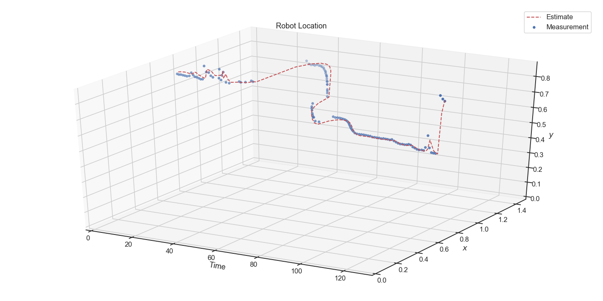

# kalman-filter
An explainer on using Kalman filters for stochastic inference.

This explainer is largely based on this paper[^1] by _Mohamed Laaraiedh_.
More information on Kalman Filters can be found here[^2].
The data used in this explainer is the Wall-Following Robot Navigation data set[^3] from the UCI Machine Learning Repository[^4]. 

## Plots

## References
- [^1]: [Laaraiedh, Mohamed. 2012. Implementation of Kalman Filter with Python Language.](https://arxiv.org/pdf/1204.0375.pdf)
- [^2]: [Kalman Filter Wikipedia](https://en.wikipedia.org/wiki/Kalman_filter_)
- [^3]: [Wall-Following Robot Navigation Data Data Set](https://archive.ics.uci.edu/ml/datasets/Wall-Following+Robot+Navigation+Data)
- [^4]: [Dua, D. and Graff, C. (2019). UCI Machine Learning Repository. Irvine, CA: University of California, School of Information and Computer Science.](http://archive.ics.uci.edu/ml)
