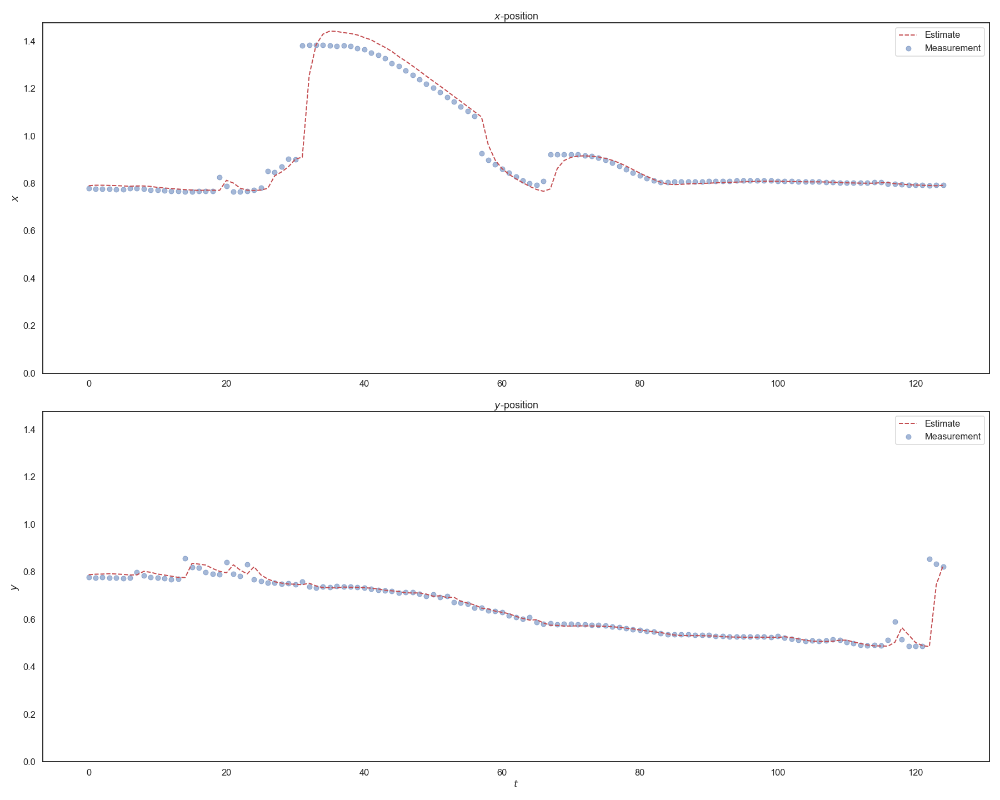

# kalman-filter
An explainer on using Kalman filters for stochastic inference.

## Overview
This explainer is largely based on this [paper](assets/resources/Implementation-of-Kalman-Filter-with-Python-Language.pdf)[^1] by _Mohamed Laaraiedh_, and this [book](assets/resources/Kalman_and_Bayesian_Filters_in_Python.pdf)[^2] by _Roger Labbe_.
Basic information on Kalman Filters can be found [here](https://en.wikipedia.org/wiki/Kalman_filter)[^3].
The data used in this explainer is the [Wall-Following Robot Navigation data set](https://archive.ics.uci.edu/ml/datasets/Wall-Following+Robot+Navigation+Data)[^4] from the [UCI Machine Learning Repository](https://archive.ics.uci.edu/ml/index.php)[^5].

## Theory
_Coming Soon_

## Plots
These plots show the measurements of the x- and y-positions and the corresponding estimates from the Kalman Filter.
### 3D Plot

### 2D Plots

## References
- [^1]: [Laaraiedh, Mohamed. 2012. Implementation of Kalman Filter with Python Language.](https://arxiv.org/abs/1204.0375)
- [^2]: [Labbe, Roger. Kalman and Bayesian Filters in Python.](http://nbviewer.ipython.org/github/rlabbe/Kalman-and-Bayesian-Filters-in-Python/blob/master/table_of_contents.ipynb)
- [^3]: [Wikipedia, Kalman Filter](https://en.wikipedia.org/wiki/Kalman_filter)
- [^4]: [Wall-Following Robot Navigation Data Data Set](https://archive.ics.uci.edu/ml/datasets/Wall-Following+Robot+Navigation+Data)
- [^5]: [Dua, D. and Graff, C. (2019). UCI Machine Learning Repository. Irvine, CA: University of California, School of Information and Computer Science.](http://archive.ics.uci.edu/ml)
